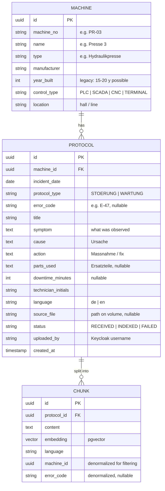

# Domain Model — v0.1 (Draft for review)

## 1. Entities

## 2. Design decisions & assumptions

- **Users are NOT in the database.** Identity, roles, and credentials live in Keycloak; the app only reads token claims. `uploaded_by` stores the username string for traceability, no FK.
- **Original files on a Docker volume,** path stored in `PROTOCOL.source_file` — not as BLOBs in Postgres. Keeps the DB small and backups simple. (Phase 2 option: object storage.)
- **Denormalized `machine_id` / `error_code` on CHUNK** so vector search can filter by machine (US-3) in one query: `WHERE machine_id = ? ORDER BY embedding <=> :query_vector`.
- **Structured fields (symptom/cause/action) instead of one text blob.** Real protocols are messy, but the *system's own* created protocols (Schichtleiter form) are structured — a quality argument. Uploaded PDFs land in `symptom`-like raw text after extraction.
- **Answer-mode logic is not a table.** Mode A vs. Mode B (grounded/ungrounded) is runtime behavior: retrieval returns hits above a similarity threshold → Mode A; below → Mode B. Threshold configurable.
- **No query logging of personal data.** If query logging is added for demo/metrics, it stores role + timestamp + answer mode only, never username — a deliberate DSGVO talking point (Datenminimierung).

## 3. Synthetic corpus plan (~150 protocols)

| Aspect | Plan |
|---|---|
| Machines | 8–10: e.g. 2 hydraulic presses (one 2005, one 2021 — same type, different age), CNC mill, robot welding cell, packaging line, compressor, conveyor. Mixed control types (PLC-only legacy, SCADA, terminal). |
| Languages | ~70% German, ~30% English (US plant flavor for the EN ones) |
| Quality mix | ~60% structured, ~30% free-text/messy, ~10% short and unhelpful ("repariert, läuft wieder") — realistic |
| Demo seeds | Error E-47 on Presse 3 appears 2–3x with consistent cause/fix (US-1/US-2 demo). One machine has deliberately NO protocol for a common error → Mode B demo. One DE query must match an EN protocol (multilingual demo). Operator-safe cases: sensor cleaning, material jam, program change. |
| Generation | Generated with Claude, structure based on my own experience with maintenance documentation in US and German manufacturing. Documented in AI-USAGE.md. |

## 4. Open for review

1. `error_code` is free text, not a lookup table — real plants rarely have a clean code catalog across machine generations. Acceptable?
2. `downtime_minutes` is captured but unused in Phase 1 (no reporting). Keep (cheap, enables a future stats view) or drop (YAGNI)?
