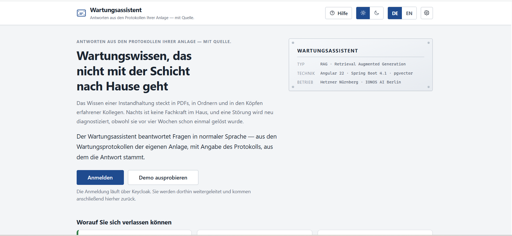
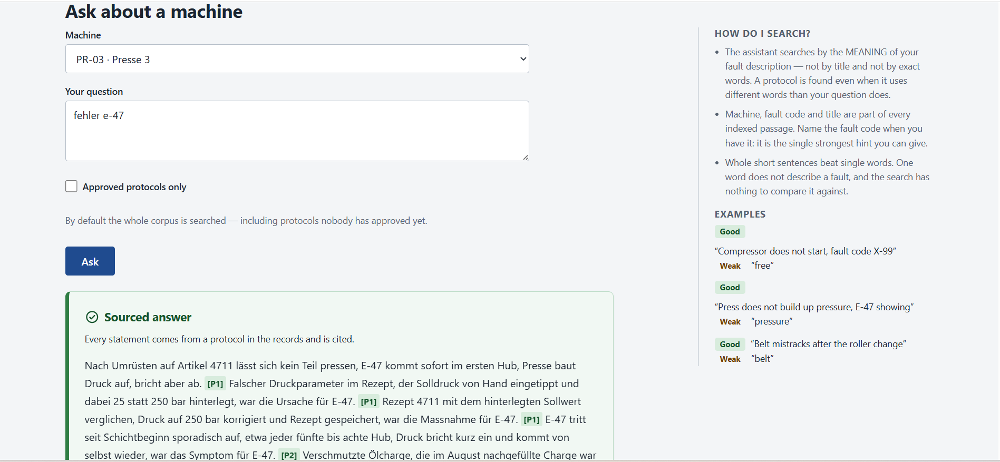
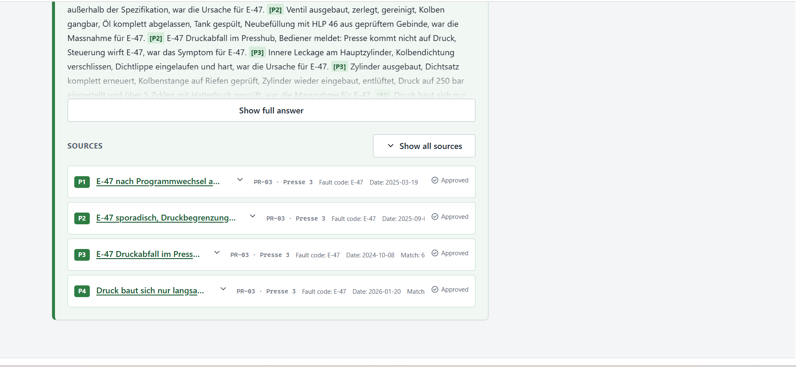
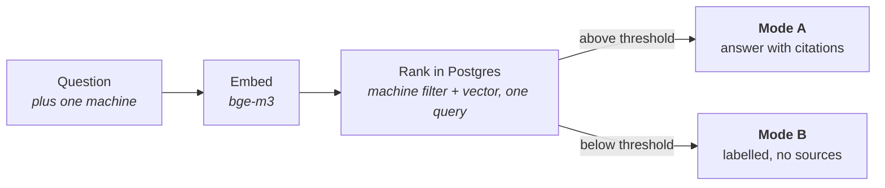

# Maintenance Assistant

**Retrieval-augmented answers from a plant's own maintenance protocols — Java 21 / Spring Boot 4.1 backend, Angular 22 frontend, PostgreSQL + pgvector**

A plant's maintenance knowledge sits in PDFs, in folders and in the heads of experienced colleagues. At night no technician is on site, and a fault gets diagnosed from scratch although it was solved four weeks ago. The Maintenance Assistant answers questions in plain language — from the plant's own maintenance protocols, naming the protocol each answer came from, so the answer can be checked rather than believed.

The product ships to users as **Wartungsassistent**; the interface is bilingual English and German, switched at runtime.

**Live demo:** <https://maintenance.smartsupply.com.de> — the demo accounts are listed on the login page. Sign in as any of them; the role decides what an answer contains.

---

## Table of Contents

1. [Screenshots](#screenshots)
2. [What it does](#what-it-does)
3. [How retrieval works](#how-retrieval-works)
4. [The trust chain](#the-trust-chain)
5. [Decisions worth noticing](#decisions-worth-noticing)
6. [Documentation](#documentation)
7. [Tech stack](#tech-stack)
8. [Testing](#testing)
9. [CI/CD and deployment](#cicd-and-deployment)
10. [Roadmap](#roadmap)
11. [License](#license)

---

## Screenshots

**A sourced answer.** The question is in plain German; the answer carries inline markers back to the protocols it was built from, with the search help panel alongside.

**The sources behind one answer.** Four protocols for the same fault code, each with its own approval state — the corpus deliberately holds several legitimate causes for one error, and the answer cites all of them.

---

## What it does

- **Grounded answers carry their sources.** A *Mode A* answer cites the protocol behind every claim, with inline `[P1]…[P4]` markers that open the original document in a read-only viewer.
- **Ungrounded answers say so.** When nothing matches well enough, the system does not invent a source: it returns a *Mode B* answer, visually distinct, labelled as general engineering knowledge, with no source list. That distinction is the anti-hallucination mechanism, not a colour scheme.
- **Answers are filtered by role, server-side.** An operator gets what an instructed person may do — clear a jam, clean a sensor — plus an explicit "call a technician". A Techniker gets the full technical answer.
- **Cross-language retrieval, no translation step.** A German question retrieves an English protocol and is answered in German, citing that English document; a multilingual embedding model puts both languages in one vector space.

It is not a ticketing or CMMS system, and it does not replace a technician.

---

## How retrieval works

Protocols are chunked, embedded and stored in PostgreSQL with pgvector, so one SQL statement applies the machine filter and the vector ranking together — the result is always the best matches *of that machine*, never a global ranking filtered afterwards. Above the threshold the retrieved chunks go to the language model under a citation contract, and every marker it emits is validated against what was actually retrieved before the answer is returned. The threshold is a configuration property, measured against the real corpus rather than guessed ([ADR-002](docs/adr/ADR-002-eu-hosted-llm-provider.md)).

---

## The trust chain

An answer is only as trustworthy as the protocol under it, so the corpus has a review workflow with the roles held apart: **the Techniker writes, the Schichtleiter corrects, the Admin approves — and nobody holds two of those jobs.**

- **Approval is a statement, not a gate.** An unapproved protocol stays searchable — the reviewer may not read at a weekend and the factory does not stop — and every answer and source card shows the state, so an unreviewed claim never looks reviewed.
- **The role split is the enforcement, and a test measures it.** `RoleMatrixIT` issues a real request per endpoint and role, and fails the build if any role gains both a corpus-write authority and the approve authority.
- **Duplicate detection warns and never blocks.** Approving shows similar protocols on the same machine with their approval state, and the approve button stays enabled — the corpus holds four legitimate protocols for one fault code, and a check that could refuse them would make it worse.
- **Every change is accountable.** Corrections and removals require a stated reason, an edit resets approval and forces a re-index, and deletion is an archive with no restore: removing a bad protocol must not destroy the record of who filed it.

---

## Decisions worth noticing

| | |
|---|---|
| [ADR-001](docs/adr/ADR-001-modular-monolith-first.md) | Modular monolith first, with the seam for a later extraction drawn deliberately |
| [ADR-002](docs/adr/ADR-002-eu-hosted-llm-provider.md) | EU-hosted embeddings and chat — a two-round spike that **reversed** its own proposal |
| [ADR-003](docs/adr/ADR-003-keycloak-for-iam.md) | Keycloak as the identity provider |
| [ADR-004](docs/adr/ADR-004-pgvector-for-vector-search.md) | pgvector inside PostgreSQL rather than a dedicated vector database, so filter and ranking stay one query |
| [ADR-005](docs/adr/ADR-005-spa-token-handling.md) | Keep the public-client SPA, harden it, document the BFF alternative |
| [ADR-006](docs/adr/ADR-006-insider-threat-and-protocol-moderation.md) | The insider threat, the trust chain, duplicate detection and the accountability rules above |
| [ADR-007](docs/adr/ADR-007-end-to-end-testing-strategy.md) | Rendered end-to-end tests and visual regression — jsdom cannot see a heading at 1.09:1 contrast |

**EU-only processing.** Embeddings and answers come from the IONOS AI Model Hub in Berlin, on a host in Nuremberg; no data leaves the EU. The frontend loads no external fonts, no icon CDN and no trackers — partly data protection, partly because the deployed Content-Security-Policy would refuse them.

**Honest scope.** The corpus is 165 synthetic protocols written for this project, not real plant data. The demo runs on one host with no redundancy, and latency depends on shared serverless capacity at the provider. What this demonstrates is the engineering around a RAG system, not a production service level.

---

## Documentation

- **[Documentation site](https://keglev.github.io/maintenance-assistant/)** — everything below, published by CI.
- **[Architecture (arc42)](https://keglev.github.io/maintenance-assistant/architecture/)** — context, building blocks, runtime views, deployment topology, crosscutting concepts.
- **[Decision records](https://keglev.github.io/maintenance-assistant/adr/)** — seven ADRs, several with dated revisions recording where a decision was later reversed and why.
- **[API reference](https://keglev.github.io/maintenance-assistant/backend/api-docs/)** — from the OpenAPI specification; the live Swagger UI is public at [`/swagger-ui`](https://maintenance.smartsupply.com.de/swagger-ui).
- **Coverage** — [backend](https://keglev.github.io/maintenance-assistant/backend/coverage/) (JaCoCo) and [frontend](https://keglev.github.io/maintenance-assistant/frontend/coverage/) (vitest).
- **[AI-USAGE.md](AI-USAGE.md)** — which parts of this repository were written with AI assistance, and how they were verified.

---

## Tech stack

**Backend** — Java 21, Spring Boot 4.1, Spring Security (OAuth2 resource server), Flyway, springdoc-openapi, Bucket4j, JUnit 5, Testcontainers.

**Frontend** — Angular 22 (standalone, signals), `angular-oauth2-oidc` (Authorization Code + PKCE), vitest in jsdom, Playwright, Compodoc.

**Data and AI** — PostgreSQL 17 with pgvector and an HNSW index, 1024-dimension embeddings; `BAAI/bge-m3` for embeddings and `Llama-3.3-70B-Instruct` for answers via the IONOS AI Model Hub, with Nebius documented as the fallback.

**Identity** — Keycloak, realm `maintenance`, four roles, public client with PKCE and a custom login theme.

**Infrastructure** — Docker Compose, Caddy with automatic TLS, Hetzner CX33, GitHub Actions → GHCR → ssh deploy, nightly `pg_dump` and volume archive.

---

## Testing

- **Backend** — 220 tests: unit tests, Spring slices, and integration tests against a real PostgreSQL with pgvector through Testcontainers rather than an in-memory substitute.
- **Frontend** — 269 vitest specs in jsdom, asserting on rendered output.
- **Rendered end-to-end** — 35 Playwright cases against a real browser, a real Keycloak and a real backend: the login round trip, a citation click-through, role gating, the moderation and approval workflows, and a re-index proving an edited protocol changes the answer that cites it.
- **Visual regression** — 18 baselines over nine surfaces in both palettes, generated and compared in one pinned container, because font rendering is a property of the machine.

The rendered layers exist because the two best-caught defects of v1.0–v1.1 were invisible to jsdom and to API checks: a source link that answered 401 on a real click while `curl` with a token passed, and a login heading that measured 1.09:1 while every token in the stylesheet was correct.

---

## CI/CD and deployment

Every pull request runs a required check under one shared job name, so whichever part of the repository a change touches reports under the name branch protection demands: the backend suite against real PostgreSQL, vitest with coverage and a production build, or the documentation site with a link checker. The end-to-end and visual jobs run beside them and are advisory — [ADR-007](docs/adr/ADR-007-end-to-end-testing-strategy.md) states the bar for making them required.

On merge to `main`, CI builds images, pushes them to GHCR and deploys over ssh, then verifies over the public URL so DNS, TLS and the proxy are exercised too.

**Three files are deployed by hand, deliberately:** `docker/docker-compose.prod.yml`, `docker/caddy/Caddyfile` and the host's `.env.prod`. CI deploys images, never configuration — it runs `compose pull && up -d` against the compose file already on the host. That failure mode is quiet and was met in practice, so it has [its own runbook](https://keglev.github.io/maintenance-assistant/architecture/07-deployment-view.html).

---

## Roadmap

- **v1.3 — retrieval quality.** Hybrid keyword and semantic search, a reranker already served by the provider, and revalidation of the similarity threshold against the grown corpus — all three measured rather than assumed.
- **Refactor phase.** A structure, code and documentation review of both tiers with explicit metrics, and no behaviour change.
- **v2.0 — architecture evolution, gate first.** The first task is a written verification of whether extracting the ingestion module is warranted at this corpus size and load. "Decided against, with reasons" is an acceptable outcome and is recorded either way.

---

## License

Released under the [MIT License](LICENSE).

This is a portfolio project, but issues and suggestions are welcome via [GitHub issues](https://github.com/Keglev/maintenance-assistant/issues).
