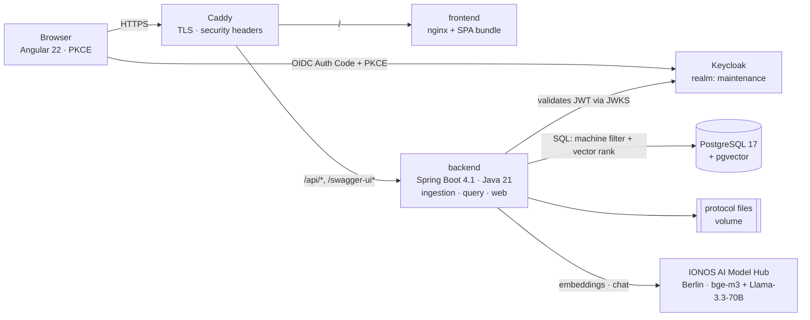

# maintenance-assistant · Wartungsassistent

**A machine stops at 02:00. No technician on site.**

The operator reads an error code off a 2005 hydraulic press that offers no diagnostics beyond that
code. The fix is written down — in a PDF, a scan, or a paper folder in a cabinet two halls away.
Often it was solved last month. Nobody can find it. So the escalation chain runs its course
(operator → technician after 10 minutes → shift supervisor → management), and every step costs
downtime. A plant's maintenance knowledge is real, it is written down, and it is unreachable at the
moment it is needed.

## What this does

Shop-floor staff ask in plain German or English — *"Presse 3 zeigt Störung E-47, was kann die
Ursache sein?"* — and get an answer built **only from that plant's own maintenance protocols**.

- **Grounded answers carry their sources.** A *Mode A* answer cites the protocol behind every claim,
  with inline `[P1]…[P4]` markers that open the original document. It can be verified rather than
  trusted.
- **Ungrounded answers say so.** When no protocol matches, the system does not invent one: it
  returns a *Mode B* answer — visually distinct, amber, explicitly labelled as general engineering
  knowledge, and with no source area at all. This distinction is the anti-hallucination mechanism,
  not a colour scheme.
- **Answers are filtered by role, server-side.** An operator gets only what an instructed person may
  do — clean a sensor, clear a jam — plus a clear "call a technician now". A Techniker gets the full
  technical answer.
- **German and English, with cross-language retrieval and no translation step.** A German question
  retrieves an English protocol and is answered in German, citing that English document. Nothing is
  translated anywhere in the system; a multilingual embedding model bridges the two languages.

It is not a ticketing or CMMS system. The escalation chain is organizational context, not a feature.

## 90-second demo

**<https://maintenance.smartsupply.com.de>**

Sign in with any of these — the role decides what the answer looks like. Password for all four is
`demo1234`, and they are public on purpose: the corpus is synthetic.

| Username | What this role can do |
|---|---|
| `operator` | Ask questions; answers contain operator-safe steps only |
| `techniker` | Ask questions; full technical answers |
| `schichtleiter` | The above, plus uploading new protocols |
| `admin` | User and role administration in Keycloak |

Then pick the machine and paste one of these. Each is tied to a seeded case and shows a different
behaviour:

| Machine | Question | What to watch for |
|---|---|---|
| **Presse 3** | `Presse 3 zeigt Störung E-47, was kann die Ursache sein?` | A green Mode A answer citing **four different protocols with four different root causes** for the same fault code |
| **Förderband FB-04** | `Förderband FB-04 läuft schief, was tun?` | A German question answered from an **English** protocol — still cited, still German |
| **Abfüllanlage AB-02** | `Die Dosierung an AB-02 ist ungenau, woran liegt das?` | No protocol covers this: an **amber Mode B** answer, explicitly unsourced, with no source list |

Two more things worth doing, in this order:

1. **Click a citation.** The original protocol opens in a new tab. That link deliberately carries no
   `href` — a browser-followed anchor sends no bearer token and the API is a stateless resource
   server, so the document is fetched through the interceptor and handed to the browser as a blob.
2. **Open the API documentation:**
   [`/swagger-ui`](https://maintenance.smartsupply.com.de/swagger-ui) — public, no login needed. The
   raw specification is at
   [`/v3/api-docs`](https://maintenance.smartsupply.com.de/v3/api-docs).

Answers take roughly 5–20 seconds: the question is embedded, ranked against the corpus, and answered
by a 70B model on shared serverless capacity.

## Architecture



A modular monolith (ADR-001) with internal `ingestion`, `query` and `web` modules, fronted by a thin
Angular client. Protocols are chunked, embedded, and stored in PostgreSQL with pgvector, so **one**
SQL query combines the machine filter with vector ranking (ADR-004) — no separate vector database.
Retrieval above a similarity threshold produces Mode A with citations validated against what was
actually retrieved; below it, Mode B. Everything runs on a single Hetzner CX33 via one
`docker compose up`, and CI deploys images to it on every merge to `main`.

**The reasoning lives in the decision records, not here:**

| | |
|---|---|
| [ADR-001](docs/adr/ADR-001-modular-monolith-first.md) | Modular monolith first, service extraction later |
| [ADR-002](docs/adr/ADR-002-eu-hosted-llm-provider.md) | EU-hosted LLM and embedding provider — a two-round spike that **reversed** its own proposal |
| [ADR-003](docs/adr/ADR-003-keycloak-for-iam.md) | Keycloak as identity provider |
| [ADR-004](docs/adr/ADR-004-pgvector-for-vector-search.md) | PostgreSQL + pgvector instead of a dedicated vector database |
| [ADR-005](docs/adr/ADR-005-spa-token-handling.md) | Keep the public-client SPA, harden it, and document the BFF |

**Published documentation site:** <https://keglev.github.io/maintenance-assistant/> —
[architecture (arc42)](https://keglev.github.io/maintenance-assistant/architecture/) ·
[decisions](https://keglev.github.io/maintenance-assistant/adr/) ·
[API reference](https://keglev.github.io/maintenance-assistant/backend/api-docs/) · test coverage
for both halves.

## Built with

| | |
|---|---|
| **Backend** | Java 21, Spring Boot 4.1, Spring Security (OAuth2 Resource Server), Flyway, springdoc-openapi, Bucket4j, JUnit 5 + Testcontainers |
| **Frontend** | Angular 22 (standalone, signals), `angular-oauth2-oidc` (Auth Code + PKCE), vitest in jsdom, Compodoc |
| **Data** | PostgreSQL 17 + pgvector, HNSW index, 1024-dimension embeddings |
| **AI** | IONOS AI Model Hub — `BAAI/bge-m3` for embeddings, `Llama-3.3-70B-Instruct` for answers; Nebius documented as the fallback |
| **Identity** | Keycloak, realm `maintenance`, four roles, public client with PKCE |
| **Infrastructure** | Docker Compose, Caddy (automatic TLS), Hetzner CX33, GitHub Actions → GHCR → ssh deploy, nightly `pg_dump` + volume archive |
| **Documentation** | arc42, ADRs, Pandoc → GitHub Pages |

**EU-only processing.** Embeddings and answers are generated by the IONOS AI Model Hub in Berlin; no
data is transferred to a third country. The frontend loads no external fonts, no icon CDN and no
trackers — partly for data protection, partly because the deployment enforces a strict
Content-Security-Policy that would refuse them anyway.

**Honest scope.** The corpus is 150 synthetic protocols written for this project, not real plant
data. The demo runs on one host with no redundancy, and answer latency depends on shared serverless
capacity at the provider. What the project demonstrates is the engineering around a RAG system —
grounding, citation, role filtering, cost control, deployment, documentation — not a production
service level.

[**AI-USAGE.md**](AI-USAGE.md) states which parts of this repository were written with AI assistance
and how they were verified.

## Local development

Requires Docker, Java 21, Maven and Node 20+. Start the three pieces in this order — each depends on
the previous.

**1. Infrastructure** — PostgreSQL + pgvector and Keycloak:

```bash
cd docker
cp .env.example .env          # never committed
docker compose up -d
```

Wait until `docker compose ps` shows both services `healthy`. Keycloak imports the `maintenance`
realm on startup: four roles, four demo users (password `demo1234`), and the public `frontend`
client. Admin console: <http://localhost:8081>.

If port 5432 is already taken by a PostgreSQL on your machine, set `POSTGRES_PORT=5433` in
`docker/.env` and pass the matching JDBC URL to the backend below.

**2. Backend** — Spring Boot on port 8080:

```bash
cd backend
mvn spring-boot:run
# with a relocated database port:
# SPRING_DATASOURCE_URL=jdbc:postgresql://localhost:5433/maintenance mvn spring-boot:run
```

Check it: <http://localhost:8080/api/health> answers `{"status":"UP",…}`, and the API documentation
is at <http://localhost:8080/swagger-ui>.

Answering questions needs an LLM API key (`LLM_API_KEY`); without one the application starts, serves
and searches, and the query endpoint reports the provider as unavailable.

**3. Frontend** — Angular dev server on port 4200:

```bash
cd frontend
npm install
npm start
```

Open <http://localhost:4200>. Logged out you land on the landing page; signing in sends you to
Keycloak and back to the search view. `/api/*` is proxied to the backend on port 8080, so the
browser stays on one origin and no CORS setup is needed.

### Tests and documentation

```bash
cd backend  && mvn verify        # JUnit + Testcontainers + JaCoCo -> backend/target/site/jacoco/
cd frontend && npm run test:ci   # vitest (jsdom)                  -> frontend/coverage/
cd frontend && npm run docs      # Compodoc                        -> frontend/documentation/
```

Coverage and generated documentation are not committed; CI regenerates them and publishes them to
the documentation site. The provider spike behind ADR-002 can be re-run from
[`spike/adr-002/`](spike/adr-002/) — see *How to reproduce* in its
[`RESULTS.md`](spike/adr-002/RESULTS.md).

### Shutting down

```bash
cd docker && docker compose down     # add -v to also drop the database volume
```

## Repository documentation

- [docs/arc42/](docs/arc42/) — architecture documentation (arc42)
- [docs/adr/](docs/adr/) — architecture decision records
- [docs/REQUIREMENTS.md](docs/REQUIREMENTS.md) — user stories and the seven NFRs
- [docs/DOMAIN-MODEL.md](docs/DOMAIN-MODEL.md) — entities and data-model rationale
- [AI-USAGE.md](AI-USAGE.md) — how AI was used in this repository

## License

[MIT](LICENSE)
