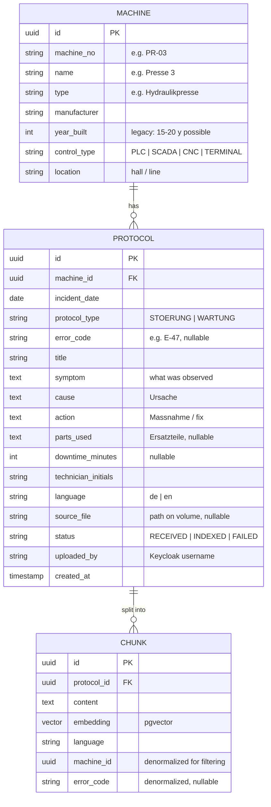

# Domain Model — v0.1 (Draft for review)

## 1. Entities

## 2. Design decisions & assumptions

- **Users are NOT in the database.** Identity, roles, and credentials live in Keycloak; the app only reads token claims. `uploaded_by` stores the username string for traceability, no FK.
- **Original files on a Docker volume,** path stored in `PROTOCOL.source_file` — not as BLOBs in Postgres. Keeps the DB small and backups simple. (Phase 2 option: object storage.)
- **Denormalized `machine_id` / `error_code` on CHUNK** so vector search can filter by machine (US-3) in one query: `WHERE machine_id = ? ORDER BY embedding <=> :query_vector`.
- **Structured fields (symptom/cause/action) instead of one text blob.** Real protocols are messy, but the *system's own* created protocols (Schichtleiter form) are structured — a quality argument. Uploaded PDFs land in `symptom`-like raw text after extraction.
- **Answer-mode logic is not a table.** Mode A vs. Mode B (grounded/ungrounded) is runtime behavior: retrieval returns hits above a similarity threshold → Mode A; below → Mode B. Threshold configurable.
- **No query logging of personal data.** If query logging is added for demo/metrics, it stores role + timestamp + answer mode only, never username — a deliberate DSGVO talking point (Datenminimierung).

## 3. Synthetic corpus plan (~150 protocols)

| Aspect | Plan |
|---|---|
| Machines | 8–10: e.g. 2 hydraulic presses (one 2005, one 2021 — same type, different age), CNC mill, robot welding cell, packaging line, compressor, conveyor. Mixed control types (PLC-only legacy, SCADA, terminal). |
| Languages | ~70% German, ~30% English (US plant flavor for the EN ones) |
| Quality mix | ~60% structured, ~30% free-text/messy, ~10% short and unhelpful ("repariert, läuft wieder") — realistic |
| Demo seeds | Error E-47 on Presse 3 appears 2–3x with consistent cause/fix (US-1/US-2 demo). One machine has deliberately NO protocol for a common error → Mode B demo. One DE query must match an EN protocol (multilingual demo). Operator-safe cases: sensor cleaning, material jam, program change. |
| Generation | Generated with Claude, structure based on my own experience with maintenance documentation in US and German manufacturing. Documented in AI-USAGE.md. |

## 4. The corpus as built (2026-08-07)

The plan above is what was intended; this section is what exists. The corpus lives at
`backend/src/main/resources/corpus/protocols.ndjson` — 150 records, ~140 KB, incidents dated
2024-09-11 to 2026-07-15. Figures below are counted from that file, not estimated.

### 4.1 Fault taxonomy

Every `STOERUNG` carries exactly one **root-cause class**. This is corpus metadata (`meta.cause_class`
in the NDJSON) and deliberately **not** a database column — the V1 schema is frozen, and the class
exists to control and verify the distribution, not to be queried at runtime.

| Class | Meaning | Count | Share of faults |
|---|---|---:|---:|
| **MATERIAL** | The material was the problem: wrong or out-of-spec batch, damp or contaminated stock, damage that jams the machine, tolerances that push parts out of position | 23 | 19% |
| **BEDIENUNG** | Operator-induced and operator-fixable: wrong program or offset, wrong clamping, a dirty photo-eye or reflector, skipped cleaning, a blocked ventilation grille, a mistyped parameter | 29 | 24% |
| **TECHNIK** | Genuine technical defect, technician-only | 68 | 57% |

The point of the split is that a real plant is **not** all technician-level defects. Roughly two in
five faults here are things the shift caused or can fix, which is what makes role-based answers
(US: Operator gets operator-safe steps) worth anything.

`TECHNIK` is spread across subtypes rather than being one bucket:

| Subtype | n | | Subtype | n |
|---|---:|---|---|---:|
| mechanisch | 27 | | roboter (TCP, wire feed, tip, gas) | 4 |
| elektrisch | 14 | | software / PLC | 3 |
| hydraulisch | 6 | | ungeklärt (never found) | 2 |
| sensorik | 6 | | pneumatisch | 2 |
| netzwerk (Profinet, SCADA) | 4 | | | |

`WARTUNG` records carry no cause class: planned work has no fault to classify.

### 4.2 Distribution

| Axis | Result |
|---|---|
| **Language** | 108 DE (72%) / 42 EN (28%). Stored **as written** — nothing is translated anywhere. |
| **Type** | 120 `STOERUNG` / 30 `WARTUNG` |
| **Quality** | 90 structured (60%) / 45 messy shift-note style (30%) / 15 short and unhelpful (10%) |
| **Resolution** | 144 resolved / 4 workaround-only / 2 never explained |
| **Error code** | 63 of 120 faults carry one; 87 records have none. Free text, and sometimes pointing at the wrong component on purpose. |
| **Per machine** | PR-03 22, FR-01 19, PR-07/RB-02/VP-01 17, FB-04 15, KP-01/SP-05 13, LS-01 11, AB-02 6 |

Twelve records deliberately avoid umlauts (`meta.charset: ascii`) — the two terminal-only legacy
machines, where text was typed on a controller that never had them. The rest is proper German.

Resolution realism is visible in the data rather than only asserted: `TECHNIK` faults name a
replaced part in 54 of 68 cases and average 193 minutes of downtime; `BEDIENUNG` faults name a part
in 5 of 29 and average 52 minutes.

### 4.3 Demo scenarios the corpus is built around

Marked with `meta.demo` in the NDJSON, and guarded by `CorpusIntegrityTest` so a reword cannot
silently break a demo.

1. **Recurring fault, three different root causes — `E-47` on Presse 3.** Three protocols share the
   error code and have a *different* root-cause class each: a worn piston seal (TECHNIK), a
   mistyped pressure setpoint after a changeover (BEDIENUNG), and a contaminated oil batch that
   jammed the relief valve (MATERIAL). A fourth, later E-47 turns out to be pump wear. This is both
   the recurring-fault demo and the argument for why the error code is only a hint: four
   occurrences, four causes.
2. **Mode B gap — `AB-02` Abfüllanlage 2.** Its six protocols cover the feed screw, CIP cleaning,
   labelling, capping torque, the infeed star and an annual inspection. Nothing covers dosing or
   fill-volume deviation. *Intended demo query:* „Abfüllanlage 2 dosiert zu wenig, Füllmenge
   schwankt" → no source above threshold → Mode B.
3. **German query, English protocol — `FB-04` Förderband 4.** Belt mistracking appears **only** in
   English (`Belt tracking off to the right, product falling off the edge`, cause: carryback built
   up on the tail pulley). No German protocol anywhere covers mistracking. *Intended demo query:*
   „Förderband läuft schief, Material fällt seitlich herunter" → the top hit must be the English
   protocol, which is the multilingual-embedding argument in one screen.

### 4.4 Realism patterns

Deliberately present, with examples:

- **Same symptom, different cause on the same machine.** Pressure loss on Presse 3 resolves four
  different ways (seal, parameter, contaminated oil, pump wear). `SV0410` on the mill is a broken
  encoder cable once and a failed servo amplifier the next year. `VP-70` on the packaging line is a
  snapped chain once and a seizing gearbox the next.
- **The alarm points at the wrong component.** A servo following-error that was a damaged encoder
  cable; a spindle over-temperature that was a failed cabinet fan; "sensor defekt" that was a dirty
  reflector; "motor defekt" that was a run capacitor; a leak-test rejecting good packs because the
  tester itself had drifted.
- **Cause never found.** Two protocols close with „nach Neustart i.O., Ursache unklar, beobachten"
  and no part replaced — because that is what actually happens.
- **Workaround only.** Four protocols document a deliberate interim state (manual tool change,
  reduced cycle rate, a shifted weld program for one part variant, raised neighbouring heater
  zones), each saying explicitly that it is not a permanent fix.
- **Mixed voice.** Some protocols quote the operator („Presse kommt nicht auf Druck"), some quote
  the alarm text, some both. Five German protocols quote the controller's **English** alarm string
  verbatim inside German prose — real controls throw English, and the retrieval has to cope.

## 5. Open for review

1. `error_code` is free text, not a lookup table — real plants rarely have a clean code catalog across machine generations. Acceptable?
2. `downtime_minutes` is captured but unused in Phase 1 (no reporting). Keep (cheap, enables a future stats view) or drop (YAGNI)?
