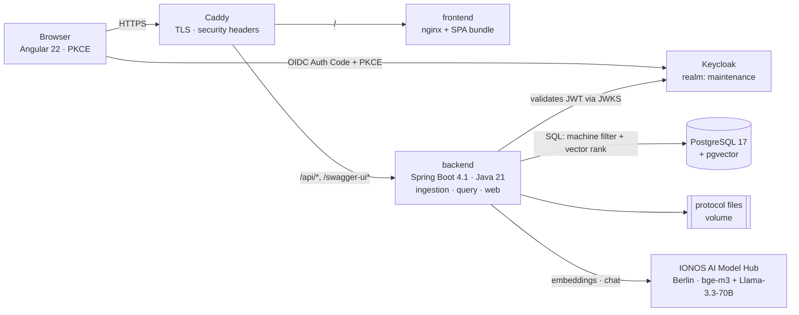

# 5. Building Block View

> **Partial.** §5.2 `ingestion` is implemented and documented; `query` follows in Phase 3.

## 5.1 Whitebox: overall system

### Container view

Moved here from the README on 2026-08-15. It had grown into a full container-and-topology diagram —
useful, but not something a reader can take in at a glance, which is what a README diagram has to be.
The README now carries only the request path; this is where the containers are described, next to
the module table they decompose into. The deployment topology proper, with volumes, published ports
and certificate issuance, is [§7](07-deployment-view.md).



### Modules

One Spring Boot application, split internally into three packages per
[ADR-001](../adr/ADR-001-modular-monolith-first.md) and
[§4.1](04-solution-strategy.md#41-decomposition):

| Module | Responsibility | State |
|---|---|---|
| **`ingestion`** | Everything that turns a submitted protocol into searchable content | Implemented (Phase 2) |
| **`query`** | Question → retrieval → grounded or ungrounded answer | Phase 3 |
| **`web`** | HTTP surface, authentication, role checks | Implemented |

The dependency direction is one-way: `web` calls into `ingestion` through two application services
and never reaches past them. That is what makes the Phase 5 extraction of `ingestion` into its own
service a deployment change rather than an untangling.

## 5.2 Level 2 — `ingestion` whitebox

```
web ─── ProtocolIntakeService ──┐                          ┌── ProtocolChunker
        (upload: file + row)    │                          │
                                ├─► ProtocolReceivedEvent ─┼── EmbeddingClient ── IONOS
web ─── IngestionBacklogService ┘   (async, own pool)      │   └ EmbeddingBudget (NFR-7)
        (catch-up by state)         IngestionEventListener │
                                    └► ProtocolIndexer ────┴── ProtocolIndexWriter ── Postgres
```

| Component | Purpose |
|---|---|
| `ProtocolIntakeService` | Writes the document to the volume and the row as `RECEIVED`, publishes the event. Does no indexing — confirmation is immediate (NFR-4). |
| `IngestionBacklogService` | Finds protocols by **state** rather than by event and republishes the same event. The catch-up path for seeded protocols and for retrying failures. |
| `ProtocolReceivedEvent` | Carries a protocol id and nothing else. **This is the Kafka seam** (ADR-001). |
| `IngestionEventListener` | `@Async` + `AFTER_COMMIT`. Deliberately logic-free: it becomes a Kafka consumer and nothing else changes. |
| `ProtocolIndexer` | The pipeline. Reads, chunks, embeds, writes, sets status. Never throws — a failure is a recorded state. |
| `ProtocolChunker` | Paragraph-based splitting with a size cap and a context prefix (see §8.2). |
| `EmbeddingClient` | One method. `IonosEmbeddingClient` is a plain `RestClient`; the interface exists so the Phase 3 chat path can revisit Spring AI, and so tests run with a fake. |
| `EmbeddingBudget` | The global daily call ceiling (NFR-7), counted in Postgres so it survives a restart. |
| `ProtocolIndexWriter` | The short transaction that replaces a protocol's chunks and moves its status. Separate from the indexer **so the transaction does not span the embedding call**. |

### Why the seams sit where they do

- **The event is an id, not a payload.** Anything richer would need serialisation, versioning and a
  consumer running an older schema. An id means both sides read the same row.
- **The writer is separate from the indexer.** Embedding is an HTTP round trip measured in seconds;
  holding a pooled connection across it would let one slow provider response starve the web layer.
- **The backlog reads state, not a queue.** The 150 seeded protocols never produced an event, and a
  protocol that failed during an outage has lost the one it had. `status` *is* the queue.

## 5.3 Level 2 — other modules

- **`query`** — Phase 3.
- **`web`** — `SecurityConfig` (resource server, realm roles → `ROLE_*`), `HealthController`,
  `HelloController`, `ProtocolUploadController` (Techniker and Schichtleiter since v1.2),
  `IngestionAdminController` (admin), `OpenApiConfig`.
- **`ModerationController`** — the trust chain's security surface, and the one place where the
  endpoint × role matrix is written down in full (class javadoc). The class rule is `ADMIN`; the
  deviations are `PUT /{id}` (SCHICHTLEITER only — the approver does not correct) and, since
  2026-08-14, the corpus list and the document read (ADMIN or SCHICHTLEITER — you cannot correct
  what you cannot find or open). Delete, approval and the archive stay ADMIN. See
  [ADR-006](../adr/ADR-006-insider-threat-and-protocol-moderation.md).
- **Angular client** — login redirect and guarded home; search and upload views in Phase 3.
  `/moderation` is reached by two roles and renders two views: the administrator reviews, approves
  and archives; the Schichtleiter corrects, and the controls they may not use are **absent rather
  than disabled**. The heading and the navigation entry are chosen by role for the same reason.
