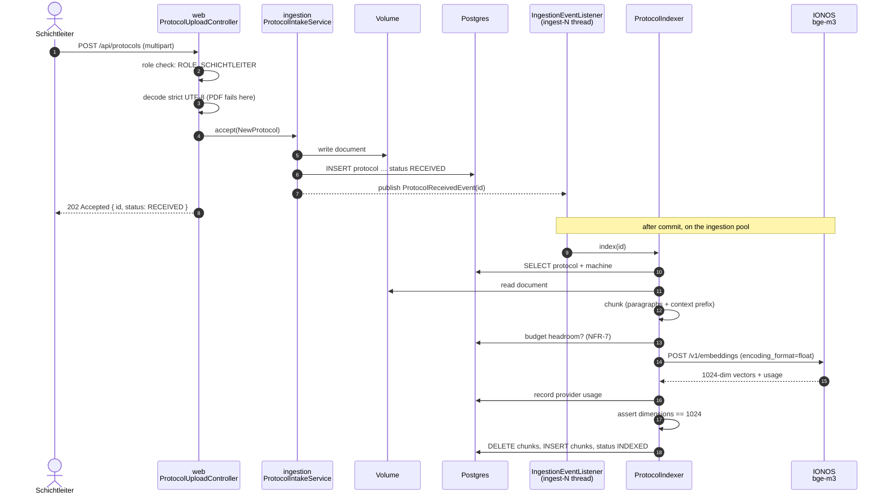
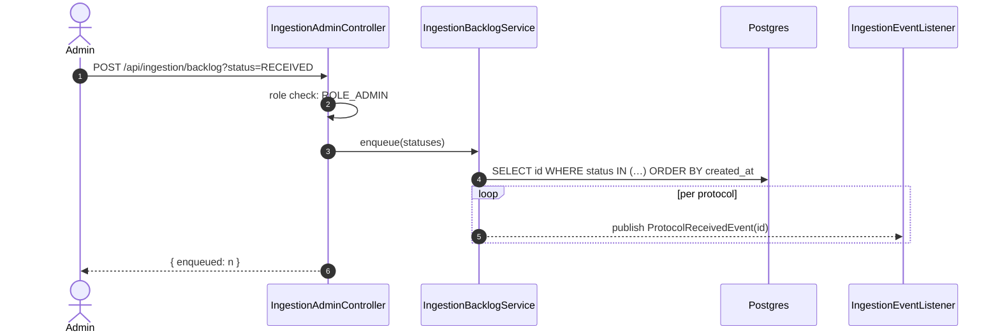

# 6. Runtime View

> **Partial.** §6.1 (upload and indexing) is implemented; the query scenarios follow in Phase 3.

## 6.1 Upload and indexing

The one flow that exists end to end today. Two halves, deliberately separated: the caller's half
finishes in milliseconds, the expensive half runs on a worker.

**Why 202 and not 201.** The protocol exists when the call returns; it is not searchable yet.
NFR-4 makes confirmation immediate, so the HTTP thread hands the work over and the returned id is
what a client polls with.

**Why `AFTER_COMMIT`.** The row and the event commit together. A worker starting before that commit
would look for a row it cannot see and fail a protocol that is perfectly fine.

**Where the transaction is not.** It does not span the embedding call — that is an HTTP round trip
measured in seconds, and a pooled connection held across it is one the web layer cannot have.

### Failure

Any step after the row exists fails the protocol, not the request: `status = FAILED`,
`failure_reason` stored, **document and row kept**. A FAILED protocol is a retry worklist entry, and
the reason is stored rather than only logged so the next person can tell a provider outage from a
corrupt file without reproducing the failure and paying for it again.

### Catch-up

The same event and the same indexer as the upload path — one indexing path, not two. It finds work
by **state** because the 150 seeded protocols never produced an event and a protocol that failed
during an outage has lost the one it had.

Re-running is safe: indexing replaces a protocol's chunks rather than adding to them. Verified on
the real corpus — re-indexing five already-indexed protocols left the chunk count unchanged at 167.

**Admin, not Schichtleiter.** This is the one operation in the application where the authorisation
question is *who pays* rather than *who may read*.

## 6.2 Budget exhaustion (NFR-7)

Headroom is checked once per protocol, before any of it is sent, so a protocol is never left
half-embedded by the ceiling arriving between batches. Over the limit,
`EmbeddingBudget.BudgetExhaustedException` fails that protocol with a readable reason, leaves its
row and file in place, and the next backlog run picks it up. Nothing is lost and the spend stops.

Usage is recorded **by the client as each request is answered**, not by the caller on success. The
first live run of this pipeline made 150 calls that were served, billed, and never counted, because
every one of them failed while parsing the response and the counting code only ran on success.

## 6.3 Planned scenarios

1. **Login** — Authorization Code + PKCE between browser, Keycloak and the resource server.
2. **Search, Mode A** — question → embedding → filtered vector search → hits above threshold →
   grounded answer with citations, filtered by the caller's role.
3. **Search, Mode B** — same path, nothing above threshold → explicit "no source in the corpus" plus
   a clearly labelled general suggestion (operator-safe steps and escalation advice for Operators).
